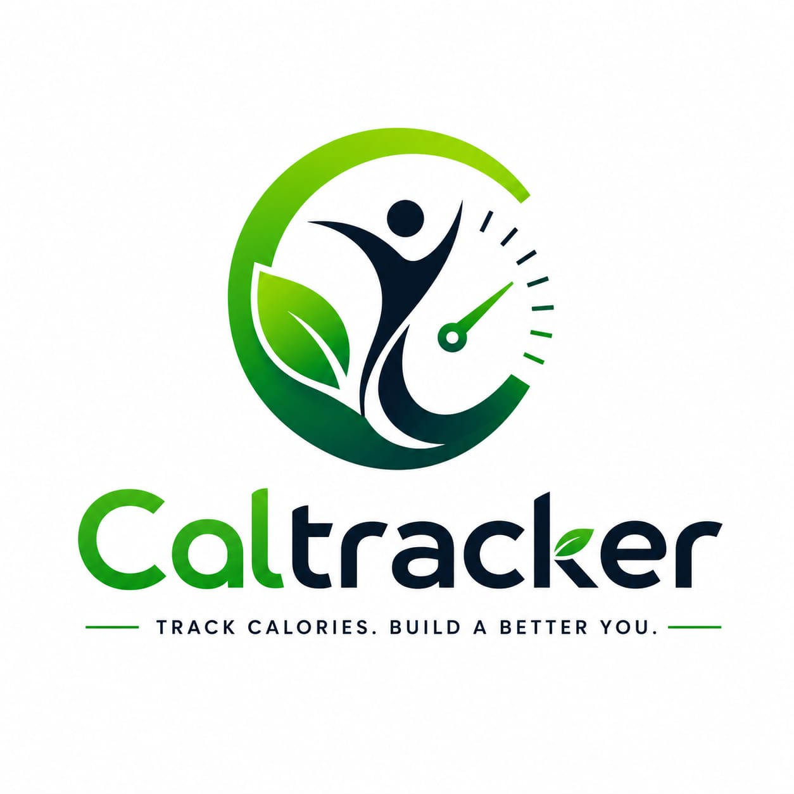

# CalTrack — Smart Nutrition & Fitness Platform



**Track Calories. Build a Better You.**

CalTrack is a smart and user-focused fitness platform designed to help individuals take control of their health through accurate BMI calculation and personalized nutrient tracking. Built especially for fitness enthusiasts, gym-goers, and individuals committed to maintaining a healthy lifestyle.

---

## 🎯 About CalTrack

CalTrack provides essential insights into body wellness by analyzing BMI and helping users understand the nutritional values required to support their fitness goals. Whether your objective is reducing obesity, maintaining body balance, or improving overall physical performance, CalTrack empowers you with reliable health metrics to make informed decisions about your diet and fitness journey.

With a professional and easy-to-use approach, the platform is dedicated to supporting users in building healthier habits, achieving body fitness goals, and maintaining long-term well-being through data-driven health tracking.

---

## ✨ Key Features

### 📊 **Comprehensive Health Metrics**
- **BMR Calculation**: Calculate your Basal Metabolic Rate using the Mifflin-St Jeor equation
- **TDEE Analysis**: Get your Total Daily Energy Expenditure based on activity level
- **Macronutrient Split**: Personalized protein, carbohydrate, and fat recommendations
- **Micronutrient Targets**: Essential vitamins and minerals recommendations (Vitamin A, B12, C, D, Iron, Calcium, Potassium, Magnesium, Zinc)
- **Hydration Needs**: Personalized daily water intake recommendations

### 🎮 **User-Friendly Interface**
- Clean, intuitive design optimized for all devices
- Real-time calculations as you update your profile
- Responsive mobile-first design
- Accessible form controls and navigation

### ⚙️ **Flexible Unit System**
- Support for both metric (kg, cm) and imperial (lbs, ft/in) units
- Easy unit conversion with toggle buttons
- Save your last calculation for quick reference

### 🎯 **Goal-Based Recommendations**
- **Lose Weight**: Deficit-based calorie calculation (-500 kcal)
- **Maintain**: TDEE-based recommendations
- **Gain Weight**: Surplus-based calorie calculation (+500 kcal)

---

## 🚀 How to Use

### Quick Start
1. Open `index.html` in your web browser
2. Fill in your personal details:
   - **Name** (optional)
   - **Age** (required)
   - **Gender** (required)
   - **Weight** (required) - toggle between kg/lbs
   - **Height** (required) - toggle between cm/ft
   - **Activity Level** (required)
   - **Weight Goal** (required)

3. Click "Calculate My Plan" button
4. View your personalized daily nutrition plan

### Understanding Your Results

**Daily Calorie Target**: Your recommended daily calorie intake based on your TDEE and fitness goal

**Macronutrient Breakdown**:
- **Protein** (30%): Essential for muscle building and recovery
- **Carbohydrates** (40%): Primary energy source
- **Fats** (30%): Important for hormonal balance and nutrient absorption

**Hydration**: Daily water intake recommendation based on body weight

**Micronutrients**: Essential vitamins and minerals for optimal body function

---

## 📋 Activity Level Guide

- **Sedentary**: Little or no exercise; mostly desk work
- **Lightly Active**: 1–3 days/week of light exercise
- **Moderately Active**: 3–5 days/week of moderate exercise
- **Very Active**: 6–7 days/week of intense exercise
- **Extra Active**: Athlete or physical job requirements

---

## 🛠️ Technical Stack

- **HTML5**: Semantic markup and accessibility features
- **CSS3**: Modern styling with CSS variables, grid, and flexbox
- **JavaScript (ES6+)**: Vanilla JavaScript with modular logic

### Project Structure
```
CalTrack/
├── index.html           # Main HTML file
├── css/
│   └── styles.css      # All styling and animations
├── js/
│   └── script.js       # Calculation logic and interactivity
├── assets/
│   └── logo.png        # CalTrack branding
└── README.md           # This file
```

### Key JavaScript Features
- Real-time unit conversion (kg ↔ lbs, cm ↔ ft)
- Dynamic calculation engine
- Local storage for saving last calculation
- Form validation and error handling
- Smooth animations and transitions

---

## 📐 Calculation Methods

### Basal Metabolic Rate (BMR)
CalTrack uses the **Mifflin-St Jeor equation**, one of the most accurate formulas for BMR calculation:

**For Men**: 
BMR = (10 × weight in kg) + (6.25 × height in cm) - (5 × age) + 5

**For Women**: 
BMR = (10 × weight in kg) + (6.25 × height in cm) - (5 × age) - 161

### Total Daily Energy Expenditure (TDEE)
TDEE = BMR × Activity Level Multiplier

Activity multipliers:
- Sedentary: 1.2
- Lightly Active: 1.375
- Moderately Active: 1.55
- Very Active: 1.725
- Extra Active: 1.9

### Goal Adjustment
- **Lose Weight**: TDEE - 500 kcal
- **Maintain**: TDEE
- **Gain Weight**: TDEE + 500 kcal

---

## 🔒 Disclaimer

**Important**: This tool provides general estimates only and should not be considered medical advice. Nutrition and fitness needs vary significantly based on individual factors not captured in this calculator, including:

- Medical conditions
- Medications
- Metabolic disorders
- Pregnancy or nursing status
- Specific dietary requirements

**Always consult a healthcare professional or registered dietitian before making significant dietary changes or starting new fitness programs.**

---

## ⚡ Features in Development

- 📈 Personalized meal plans
- 📊 Progress tracking and history
- 🍽️ Food database integration
- 💾 User profiles and data saving
- 📱 Progressive Web App (PWA) support
- 🔄 Export nutrition plans as PDF

---

## 🎨 Design Philosophy

CalTrack follows modern web design principles:

- **Accessibility First**: WCAG 2.1 AA compliant with semantic HTML
- **Mobile Responsive**: Works seamlessly on all devices
- **Performance Optimized**: Fast load times and smooth interactions
- **Clean UI**: Minimal, intuitive interface focused on functionality
- **Color Accessibility**: High contrast colors for better readability

---

## 📱 Browser Compatibility

- Chrome/Edge 90+
- Firefox 88+
- Safari 14+
- Mobile browsers (iOS Safari, Chrome Mobile)

---

## 🚀 Deployment

CalTrack can be deployed automatically to Vercel whenever code is pushed to the `main` branch.

This project is a static site, so Vercel can serve it directly from the repository root. The included `vercel.json` keeps the deployment clean and URL-friendly.

### What is automated
- GitHub stores your source code and version history
- A GitHub Actions workflow runs on every push to `main`
- Vercel receives the latest version and publishes the site

### One-time setup required on Vercel
1. Create or open your project in Vercel
2. Link the GitHub repository `Tharunkumarpogula/CalTrack`
3. Add these repository secrets in GitHub:
   - `VERCEL_TOKEN`
   - `VERCEL_ORG_ID`
   - `VERCEL_PROJECT_ID`

### After setup
- Make changes locally
- Commit and push to `main`
- GitHub Actions deploys the update to Vercel automatically

### Optional local auto-sync

If you want your local edits to be pushed to GitHub automatically while you work, run the helper script in this repo:

```powershell
.\scripts\auto-sync.ps1
```

The script watches the project, commits detected changes with a timestamp, and pushes them to `main`. Keep the terminal open while you work.

---

## 🤝 Support & Contact

For questions, feedback, or suggestions about CalTrack:
- Review the features and calculator on the website
- Check the disclaimer before using recommendations
- Consult healthcare professionals for personalized advice

---

## 📄 License

This project is provided as-is for personal and educational use.

---

## 🎓 Educational Resources

### Understanding Nutrition
- Learn about macronutrients and their roles in body function
- Understand the importance of micronutrients
- Explore different dietary approaches and their science

### Fitness Knowledge
- Activity level impacts on calorie burn
- Progressive overload in strength training
- Recovery and rest day importance

---

## 🌟 Why Choose CalTrack?

✅ **Science-Based**: Uses established nutritional formulas  
✅ **Free & Accessible**: No registration or subscriptions required  
✅ **Privacy-Focused**: All calculations happen locally in your browser  
✅ **Professional Design**: Built with modern web standards  
✅ **Easy to Use**: Intuitive interface for quick results  
✅ **Mobile Friendly**: Access from any device, anytime, anywhere  

---

**Start tracking your nutrition today and take the first step towards better health with CalTrack!**

---

*Last Updated: May 2026*  
*Version: 1.0*
